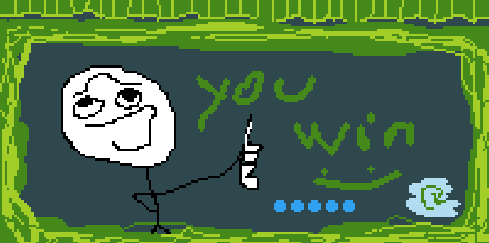

# Whateverthehack

Whateverthehack is a simple point-and-click puzzle game created for a Game Design I course. I built the entire game in just 30 minutes, dedicating most of that time to perfecting its amazing art style.

## Overview

- **Game Type:** Puzzle / Point-and-Click
- **Development Time:** 30 minutes
- **Built With:** flickgame.org
- **Art Style:** Distinctive and striking visuals

## How to Run

Download the HTML file and open it in any web browser to play the game.
OR
Simply visit this site [https://shyraptor.github.io/whateverthehack/]

## Credits

- Built on flickgame.org

## License

This project is open source. Feel free to use and modify it as you see fit.
